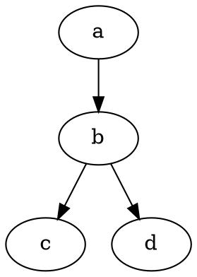
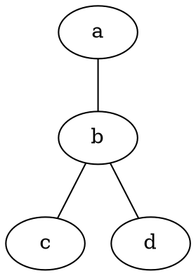

# Busca de Grafos Direcionados

## 📋 Sobre o Projeto

Este projeto implementa algoritmos de busca em grafos (DFS e BFS) com suporte à leitura de arquivos DOT/GV.

## 🔧 Leitor de Arquivos DOT

### Funcionalidades Implementadas

- **Parser manual** para arquivos `.dot` e `.gv`
- **Suporte a grafos direcionados** (`digraph`) e **não direcionados** (`graph`)
- **Arestas encadeadas**: `a -> b -> c` ou `a -- b -- c`
- **Validação de consistência**: detecta inconsistências entre tipo de grafo e tipo de aresta
- **Extensões aceitas**: apenas `.dot` e `.gv`

### Classes Principais

- `ParserDOT.java` - Parser principal para arquivos DOT
- `GrafoDOT.java` - Representação do grafo lido
- `VerticeDOT.java` - Vértice do grafo
- `ArestaDOT.java` - Aresta do grafo
- `Main.java` - Arquivo principal da aplicação

## 📄 Arquivos de Teste

### Casos Válidos
- `grafo_direcionado.dot` - Grafo direcionado com arestas encadeadas
- `grafo_nao_direcionado.dot` - Grafo não direcionado
- `grafo_sem_nome.dot` - Grafo sem nome (usa nome padrão)
- `grafo_sem_ponto_virgula.dot` - Arestas sem ponto e vírgula

### Casos com Erro
- `grafo_erro_inconsistencia.dot` - Inconsistência: `--` em grafo direcionado
- `grafo_erro_inconsistencia2.gv` - Inconsistência: `->` em grafo não direcionado

## 📋 Formato dos Arquivos

### Grafo Direcionado

### Grafo Não Direcionado

## ⚠️ Validações

- **Extensão**: apenas `.dot` e `.gv` são aceitos
- **Consistência**: `digraph` deve usar `->`, `graph` deve usar `--`
- **Em caso de erro**: apenas mensagens de erro são exibidas, grafo não é mostrado
